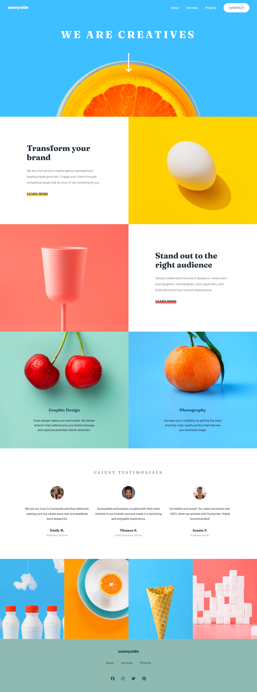

# Frontend Mentor - Sunnyside agency landing page solution

This is a solution to the [Sunnyside agency landing page challenge on Frontend Mentor](https://www.frontendmentor.io/challenges/sunnyside-agency-landing-page-7yVs3B6ef). Frontend Mentor challenges help you improve your coding skills by building realistic projects.

## Table of contents

- [Overview](#overview)
  - [The challenge](#the-challenge)
  - [Screenshot](#screenshot)
  - [Links](#links)
- [My process](#my-process)
  - [Built with](#built-with)
- [Author](#author)

## Overview

### The challenge

Users can:

- View the optimal layout for the site depending on their device's screen size
- See hover states for all interactive elements on the page

### Screenshot

### Links

- Live Site URL: [Preview the solution](https://sunnyside-agency-landing-page-three-gamma.vercel.app/)

## My process

### Built with

- Semantic HTML5 markup
- [React](https://reactjs.org/) - JS library
- [Tailwind CSS](https://tailwindcss.com/) - For styles

## Author

- Website - [Aatmane Oulmouden](https://bit.ly/3xScx29)
- Frontend Mentor - [@aatmaneoulmouden](https://www.frontendmentor.io/profile/aatmaneoulmouden)
- LinkedIn - [@aatmaneoulmouden](https://www.linkedin.com/in/aatmaneoulmouden/)